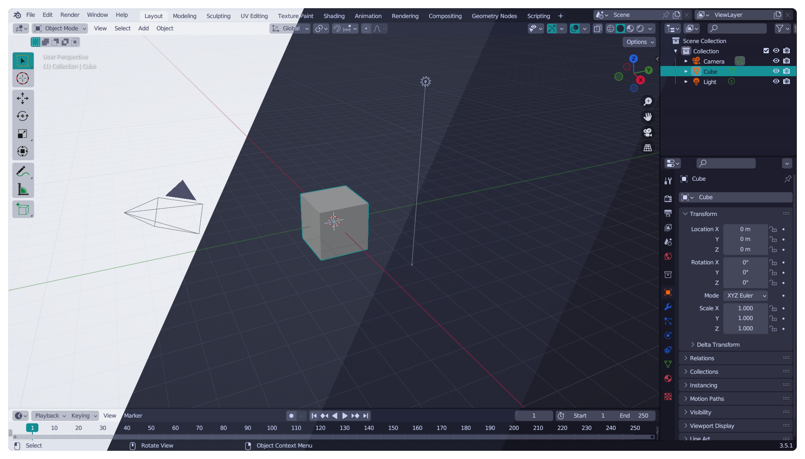
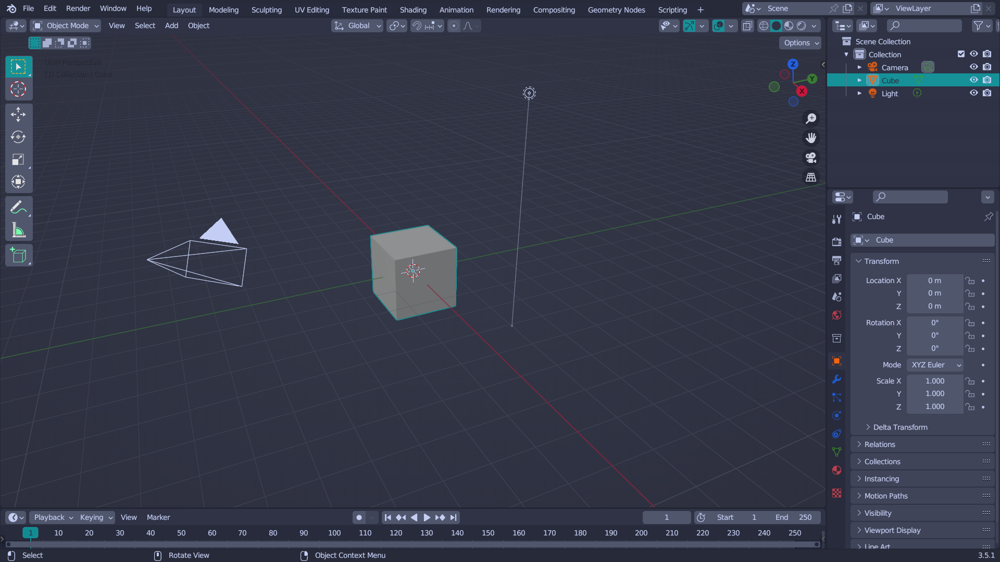
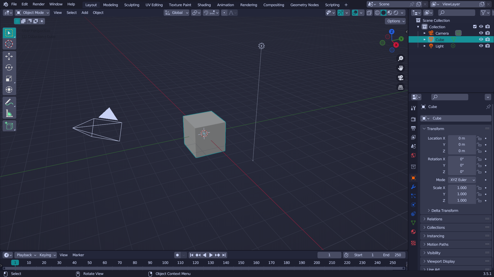
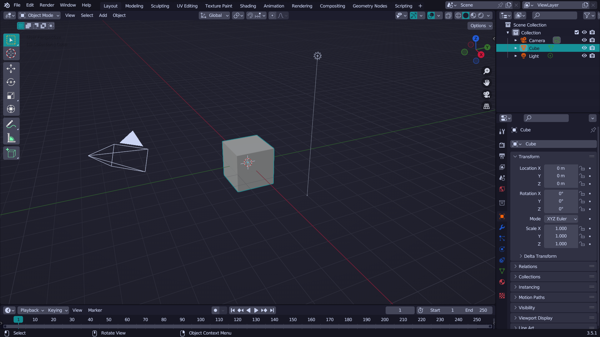
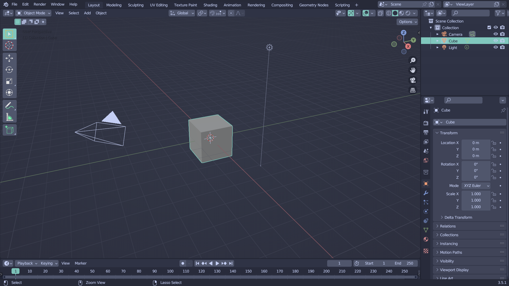

<h3 align="center">
     
    
    Catppuccin for <a href="https://www.blender.org/">Blender</a>
    
</h3>

    
    
    

    

## Previews and accents

### Contrast

🌻 Latte

🪴 Frappé

🌺 Macchiato

🌿 Mocha

### Medium (accent contrast)

🌻 Latte

🪴 Frappé

🌺 Macchiato

🌿 Mocha

### Normal

🌻 Latte

🪴 Frappé

🌺 Macchiato

🌿 Mocha

## Usage

1. Clone or download this repository or your selected `.xml` theme file locally.
2. Open Blender's settings and theme installation dialog: `Edit → Preferences → Themes → Install`.
3. Browse to where you cloned Catppuccin and install the `.xml` file of your selected flavor and accent.
4. This copies the theme into `./scripts/presets/interface_theme/` subdirectory of your Blender [configuration directory](https://docs.blender.org/manual/en/latest/advanced/blender_directory_layout.html). You may now select it from the drop down menu.

Made for Blender 3.5.

## 💝 Thanks to

- [Dalibor-P](https://github.com/Dalibor-P)
- [AmeKnite](https://github.com/ameknite)

&nbsp;

    

    Copyright &copy; 2021-present <a href="https://github.com/catppuccin" target="_blank">Catppuccin Org</a>

    

